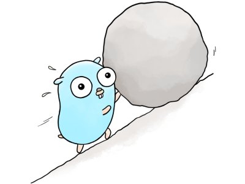

# Gosyphus: Retries with exponential backoff in Go

See [docs and examples on pkg.go.dev](https://pkg.go.dev/github.com/soroushj/gosyphus).

*The Gosyphus image is created by [Fouf](https://linktr.ee/foufia); the Go Gopher by [Renee French](http://reneefrench.blogspot.com/); both [CC BY 4.0](https://creativecommons.org/licenses/by/4.0/) licensed.*
